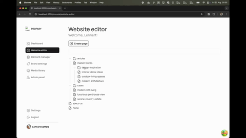

# @turbo-cms/author



## What is this project?

This project is an extension layer built on top of *Payload CMS* that introduces a powerful, flexible drag-and-drop page editor. It’s designed to make building and managing websites faster for developers while remaining intuitive for content editors.

With this system, you can:

Create custom Next.js components (both server and client) that automatically become draggable blocks in the editor.

Visually assemble pages by dragging, dropping, and rearranging components without touching code.

Style components consistently using either direct values (e.g. colors, spacing, typography) or shared variables, similar to how design tokens work in Figma.

The result is a workflow where developers define reusable building blocks in code, while editors and designers can focus on creating polished, on-brand pages — all within Payload CMS.

## Getting Started

### Prerequisites

- Node.js (version specified in `package.json`)
- bun

### Installation

1. Clone the repository:
   ```bash
   git clone <repository-url>
   ```
2. Navigate to the project directory:
   ```bash
   cd turbo-cms-2dot0
   ```
3. Install dependencies:
   ```bash
   bun install
   ```

### Running the Development Server

To start the development server, run the following command:

```bash
bun run dev
```

This will start the Next.js development server with Turbopack.

## Available Scripts

- `build`: Builds the application for production.
- `dev`: Starts the development server with Turbopack.
- `devsafe`: Starts the development server without Turbopack and clears the `.next` directory.
- `lint`: Lints the code using Next.js's built-in ESLint configuration.
- `payload`: Executes Payload CMS commands.
- `start`: Starts the production server.
- `generate:types`: Generates TypeScript types for your Payload collections.

## Project Structure

- `src/app`: Contains the Next.js application code (pages, layouts, etc.).
- `src/components`: Contains reusable React components.
- `src/config`: Contains configuration files, including Payload CMS configuration.
- `src/context`: Contains React context providers.
- `src/hooks`: Contains custom React hooks.
- `src/payload`: Contains Payload CMS collections, globals, and other configurations.
- `src/services`: Contains services for interacting with external APIs.
- `src/stores`: Contains state management stores (e.g., Zustand).
- `src/styles`: Contains global and component-specific styles.
- `src/types`: Contains TypeScript type definitions.
- `src/utils`: Contains utility functions.

## Main Dependencies

- [Next.js](https://nextjs.org/): A React framework for building server-side rendered and static web applications.
- [Payload CMS](https://payloadcms.com/): A headless CMS with a powerful API.
- [React](https://reactjs.org/): A JavaScript library for building user interfaces.
- [MongoDB](https://www.mongodb.com/): A NoSQL database.
- [TypeScript](https://www.typescriptlang.org/): A typed superset of JavaScript.
- [Zustand](https://github.com/pmndrs/zustand): A small, fast and scalable bearbones state-management solution.
- [DND Kit](https://dndkit.com/): A lightweight, modular, and accessible drag and drop toolkit for React.

## Configuration

The application uses `.env.development` and `.env.production` files for environment variables. You can copy the `.env.example` file to create your own `.env` files.
